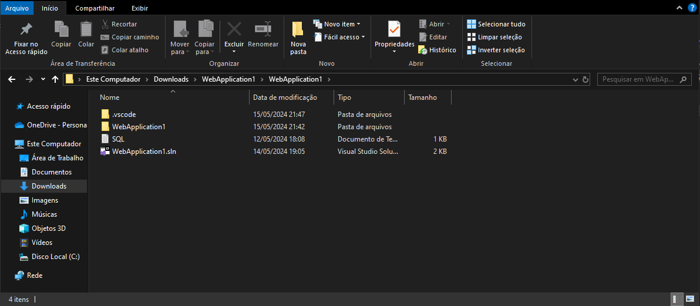
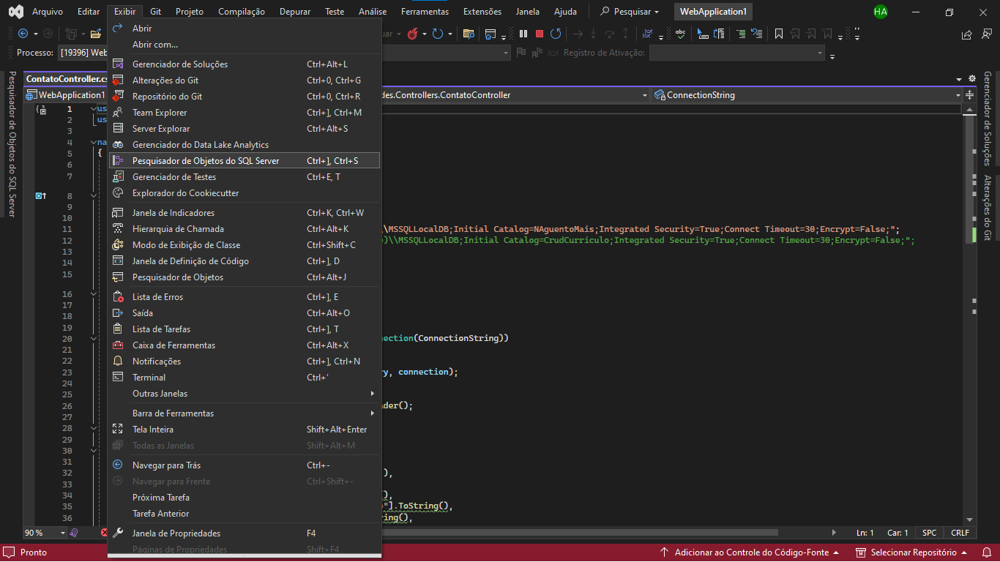
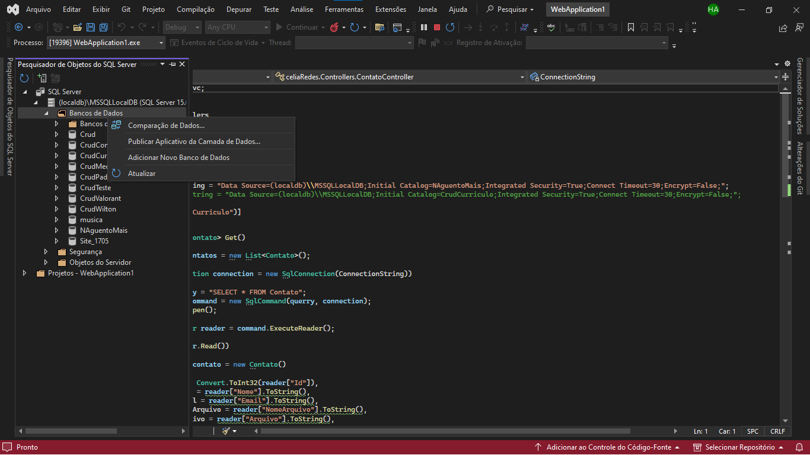
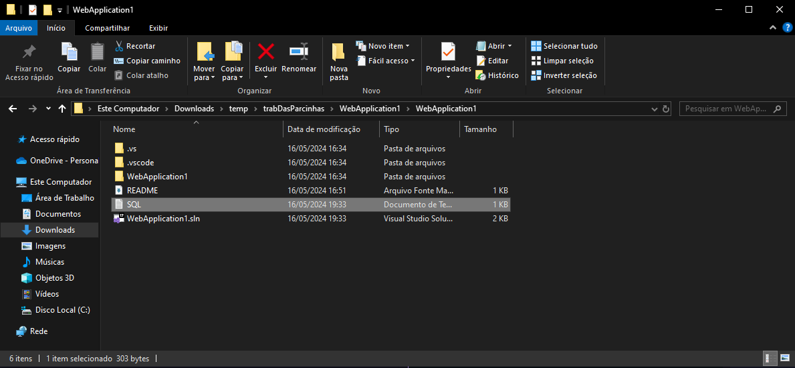
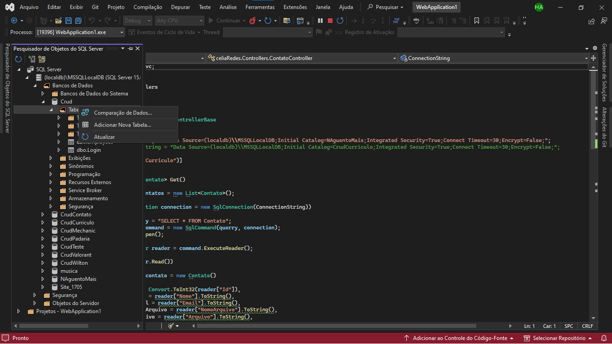
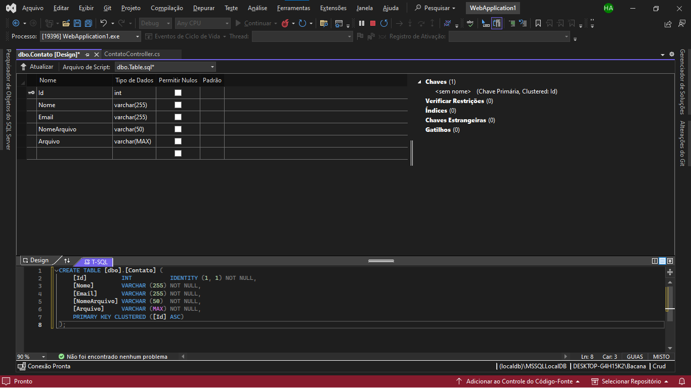
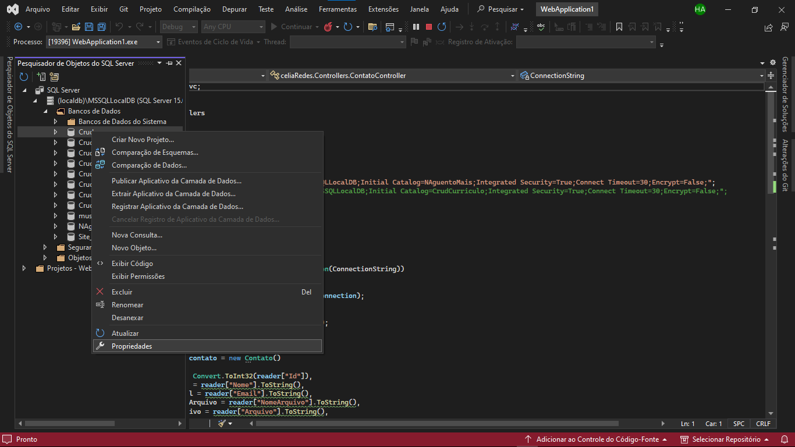
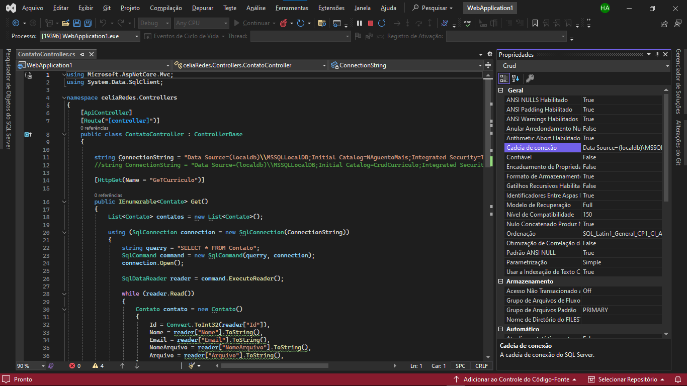
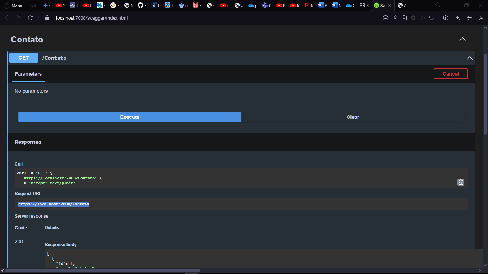

# Tutorial do Sistema - Analista de comunicação

## Abra a plicação

- Vá até o local da pasta;
- Abra a Solução clicando 2 vezes sobre o ícone.
  

## Abrir pesquisador SQL

- Clique em exibir no canto superior esquerdo do Visual Studio 2022;
- Abra o Pesquisador de Objetos do SQL Server.
  

## Criar banco de dados

- Ao abir o pesquisador SQL, vá até o diretório banco de dados;
- Clique com o botão direito do mouse e escolha a opção `Criar banco de dados`
  

## Criar tabela

- Abra o arquivo `SQL.txt` e copie seu conteúdo;
  
- Vá para o diretório da tabela e clique com o botão direito do mouse para criar uma nova tabela;
  
- Cole o comando copiado na área de transferência;
- Execute os comandos.
  

## Mudar a conexão com o Banco de Dados

- Clique com o botão direito no banco de dados que você criou;
- Escolha a opção de propriedades;
  
- Copie o texto da cadeia da conexão;
  
- Vá até o arquivo `ContatoController.cs`;
- Mude o conteúdo de dentro das aspas `""` para o que foi copiado na área de transferência **(Linha 11, na variável ConnectionString)**;

## Iniciar a API

- Clique no botão de executar do Visual Studio 2022;
- A API irá abrir o Swagger;
- Tente executar uma vez o método `GET` para ter acesso a porta da sua API.
  

## Alterar a porta da API

- Vá até o arquivo `contato.html`
- Modifique o conteúdo das aspas `""`, com a porta copiada para a área de transferência nos comandos `fetch` **Linha 261, 329**.

## Iniciar o site

> Abra o arquivo `index.html` no seu navegador para ter cesse a todo o sistema.
